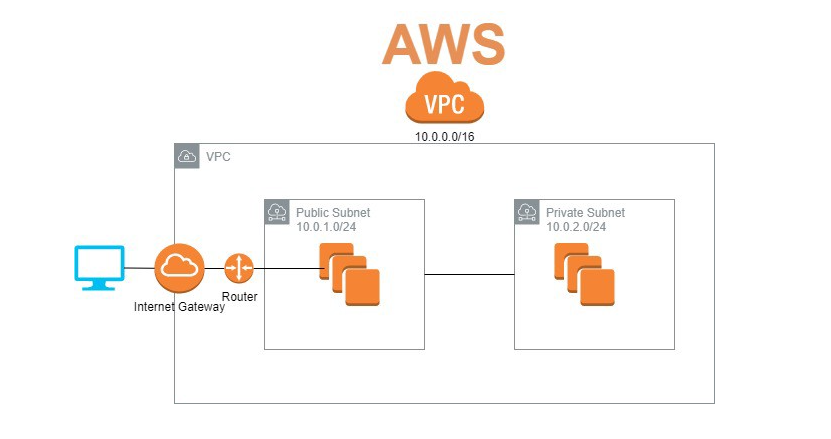

### Virtual Private Cloud

-  A virtual network dedicated to our AWS account. Logically isolated from other virtual networks in the AWS cloud. EC2 instances can be launched into your VPC as well as other AWS resources. 
- When you create a VPC, a range of IPv4 addresses are specified in the form of a CIDR block, e.g. 10.0.0.0/16. 

## CIDR Block
- Class Inter Domain Routing is the alternate method of representing a subnet mask
- Used to specify a range of IP addresses in format of IPv4 or IPv6. 
- General format of CIDR Blocks: x.y.z.t/p
- x, y, z and t are numbers from 0 to 255. Each represents a 8 bit binary number. the combination of the numbers makes up the IPv4 address.
- In the case of AWS p is a number between 16 and 28 and represents the number of bits that are inherited from given IP addresses. For example 10.0.0.0/16 represents an IP address following the format: 10.0.x.y where x and y are any number from 0 to 255, so it actually represents a range of IP addresses starting from 10.0.0.0 to 10.0.255.255. 

## IPv4 and IPv6 
- IP addressing is a logical means of assigning addresses to devices on a network where each device connected to the internet requires a unique IP address. 
- IPv4 is a 32-bit IP address whereas IPv6 is a 128-bit address. 
- IPv4 has the format x.x.x.x where each x can be any value between 0 and 255, e.g a valid IPv4 address can be 192.0.2.146. 
- IPv4 routes most of today's internet traffic. A 32 bit address limits the number of unique hosts to 232 which is around 4 billion IPv4 addresses for the world to use. However with more devices connected to the internet the number of available IPv4 addresses are running out. Therefore IPv6 has been created.
- IPv6 uses 128 bit addressing using numbers and letters in identifiers. Ipv6 has 2^128 unique identifying addresses which is 340 undecillion (340 billion billion billion)

## Routing Table
- A routing table consists of a set of rules, usually in table format to determine where data packets travelling over an IP network will be directed. IP enables devices such as routers and network swithces use routing tables.
- The routing table contains the necessary information to forward a packet along a optimal path to its destination. A basic routing table contains the following information:
- Destination: The IP address of the packet's final destination
- Next Hop: The IP address to which the packet is forwarded
- Interface: The outgoing network interface the device should use when forwarding the packet to the next hop or final destination
- Metric: Assigns a cost to each available route so that the most cost effective path can be chosen
- Routes: Include directly attached subnets, indirect subnets that are not attached to the device can be accessed through one or more hops, and default routes to use for certain types of trafic or when information is lacking

## Internet Gateway
- A horizontally scaled, redundant and highly available VPC component that allows communication between your VPC and the internet. 
- Serves two purposes: Provide a target in your VPC route tables for internet-routable traffic, and to perform network address translation (NAT) for instances that have been assigned a public IPv4 address. 
- Supports both IPv4 and IPv6 traffic. 

## Subnets
- A subnet is a range of IP addresses in your VPC. you can launch AWS resources like EC2 instances into a specific subnet.
- When creating a subnet you must specify the IPv4 CIDR block for the subnet. 
- Each subnet resides entirely within one availability zone. 

## NACL
- Optional layer of security that acts as a firewall, controls traffic coming in and out of a subnet. Multiple subnets can be associated with a single NACL.
- NACL rules can have similar rules to the security groups to add an extra layer of security. 

## Stateless and Stateful
- Security groups are stateful, acts as the firewall for an EC2 instance.
- NACL's are stateless and act as the firewall to the VPC subnets.
- Security rules only allow rules and do not deny whereas NACLs can allow and deny rules therefore can prevent certain IP addresses from accessing the subnets. 

## Creating a VPC in AWS
# App VPC
- Step 1: Create VPC and Subnets
- Step 2: Create Internet Gateway
  - 2.1: Attach internet gateway with VPC
- Step 3: Create public subnet for application
- Step 4: Create routing table with routes and rules
  - 4.1: Edit routes to allow IG and VPC (Select the IG created within VPC service of AWS)
  - 4.2: Associate route table to our public subnet (Secured access to database by placing it in  a private subnet, no access to the public internet)
Step 5: Create a security group now or create when we launch our app, port 22 from MY-IP, port 3000, port 80 HTTP

# App and DB VPC
- Create private subnet 
- Reboot DB AMI EC2 inside private subnet
- Modify Security group of DB so that private subnet has no internet access and only connects to app AMI, use the private subnet IP 10.0.7.0/24 for port 22 and port 27017.
- SSH into app EC2, change the env var so that DB_HOST uses the private IP of DB subnet, located in the description page of DB_VPC AMI 
- cd into app folder and run npm install and npm start to boot app.